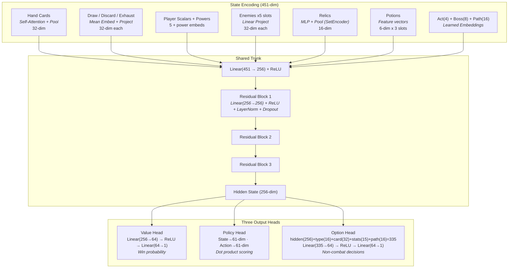

# AlphaZero Training System — How It Works

A plain-language guide to how our neural network learns to play Slay the Spire 2.

---

## The Big Picture

We're teaching a computer to play STS2 by having it play against itself thousands
of times, learning from every win and loss. This is the same approach DeepMind used
to master Go and Chess (AlphaZero). The system has three parts:

1. **A neural network** that looks at a game state and says "I think I'll win with
   probability X" and "these are the moves I think are best"
2. **A tree search (MCTS)** that uses the network to think ahead many moves
3. **A training loop** that plays games, collects the results, and updates the
   network to be slightly better each time

Over hundreds of generations, the network gets better at evaluating positions, the
tree search gets better guidance, and the whole system improves.

---

## Part 1: The Neural Network

**File:** `sts2-solver/src/sts2_solver/alphazero/network.py`

### Architecture overview



### What it does

The network is a function that takes in a game state (your hand, HP, enemies, etc.)
and produces predictions:

```
Game State  -->  [ Neural Network ]  -->  "I think we have a 60% chance of winning"
                                    -->  "Play Strike on enemy 2 (35%), Defend (30%), ..."
```

### How game state becomes numbers

Neural networks only understand numbers, so we first convert the game state into
**tensors** (multi-dimensional arrays of numbers).

**File:** `sts2-solver/src/sts2_solver/alphazero/state_tensor.py`
**File:** `sts2-solver/src/sts2_solver/alphazero/encoding.py`

Each game concept gets encoded differently:

| Concept | Encoding approach | Why this way |
|---------|-------------------|--------------|
| Card identity (Strike, Defend, ...) | **Learned embedding** — each card gets a 32-number fingerprint that the network discovers on its own | There are ~400 cards. A one-hot vector would be 400 numbers per card. A learned 32-dim embedding is compact and captures similarity (all Attacks end up near each other). |
| Card stats (cost, damage, block) | **Normalized floats** — damage/30, cost/5, etc. | Simple and direct. Normalizing to roughly [0,1] helps the network learn faster. |
| Card type, target type | **One-hot vectors** — [1,0,0,0,0] for Attack, [0,1,0,0,0] for Skill, etc. | Categories with no natural ordering. One-hot is the standard approach. |
| HP, block, energy | **Scalar floats** — both raw and as fractions (hp/max_hp) | Fractions give relative context (20 HP means different things at 70 max vs 200 max). Raw values preserve absolute info. |
| Powers (Strength, Weak, ...) | **Embedding + log-scaled amount** | Embedding captures power identity. Log scale handles the huge range (Strength 2 vs Poison 60) without one dominating. `log1p(abs(x))` compresses large values. |
| Hand (variable size) | **Self-attention + mean pool** | Hands vary from 0-15 cards. Attention lets cards "look at" each other (a Defend is more valuable when you also have Entrench). Mean pooling collapses variable-length to fixed-length. |
| Draw/Discard/Exhaust piles | **Mean of card embeddings** | Simpler than the hand — we don't need card-to-card attention for piles, just a summary of what's in there. |
| Enemies (variable count) | **Fixed slots (max 5)** with padding | Each slot has HP, block, intent, and power features. Empty slots are zeroed out. A small linear layer projects each enemy to 32 dimensions. |
| Relics | **Self-attention encoder (SetEncoder)** — 16-dim output | Like the hand encoder but for relics. Attention lets relics "see" each other (Kunai is more valuable with shiv-generating cards). Permutation-invariant — relic order doesn't matter. |
| Act ID | **Learned embedding** — 4-dim | Which world we're in (Overgrowth, Underdocks, Hive, Glory). Different acts have different card pools, enemies, and strategies. |
| Boss ID | **Learned embedding** — 8-dim | Which boss to prepare for (e.g., Ceremonial Beast vs Soul Fysh). Pre-picked at run start, visible on the map. Affects card/relic evaluation for the entire run. |
| Map path | **Ordered sequence encoder (SequenceEncoder)** — 16-dim | Remaining room types ahead (Monster, Elite, RestSite, etc.) in BFS order. Has positional embeddings so "Elite next" is different from "Elite in 5 floors." |
| Potions | **Feature vectors** — 6-dim per slot | occupied flag + type one-hot (heal/block/strength/damage/weak). |

All of these pieces get concatenated (joined end-to-end) into one long vector
(451 numbers), which feeds into the **trunk**.

### The trunk (shared backbone)

```
[451-dim input]
       |
  Linear(451 -> 256) + ReLU        <-- compress to 256 dimensions
       |
  ┌─ Residual Block (x3) ─────────────────────────────────────────┐
  │  Linear(256 -> 256) + ReLU   <-- refine                       │
  │       + residual connection  <-- add the input back            │
  │       + LayerNorm            <-- normalize (stabilizes training)│
  │       + Dropout(10%)         <-- prevents overfitting          │
  └────────────────────────────────────────────────────────────────┘
       |
  [256-dim hidden state]            <-- this is the network's "understanding" of the position
```

The trunk depth (3 blocks) is configurable via `num_trunk_blocks`. Deeper trunks
let the network learn more complex feature interactions at the cost of more
parameters and slower training.

**Residual connection:** Instead of just `output = f(input)`, we do
`output = input + f(input)`. This means the network can easily learn "do nothing"
(just pass information through) and only make small adjustments. Without this,
deep networks can suffer from vanishing gradients — the learning signal gets
weaker as it flows backward through layers.

**LayerNorm:** Normalizes the 256 values to have zero mean and unit variance.
This prevents values from growing uncontrollably during training, which would
cause NaN (not-a-number) errors.

**Dropout:** During training (not inference), randomly zeros out 10% of neurons.
This forces the network to not rely too heavily on any single feature, making it
more robust. Think of it as training multiple slightly different networks and
averaging them.

### The three output heads

The 256-dim hidden state feeds into three specialized heads:

#### 1. Value Head — "How likely are we to win?"

```
hidden(256) -> Linear(256->64) -> ReLU -> Linear(64->1) -> scalar
```

Outputs a single number. Positive = likely winning, negative = likely losing.
Range roughly [-1, +1].

*Design choice:* No `tanh` activation on the output. Many implementations use
`tanh` to clamp to [-1,1], but tanh has **gradient saturation** — when the output
is near +1 or -1, the gradient becomes nearly zero, so the network can't learn
from strong wins/losses. We clamp the *targets* instead.

#### 2. Policy Head — "Which move should I make?"

This is the most architecturally interesting head. Instead of a simple
"output one score per possible action" approach (which doesn't work because the
action space changes every turn), we use **action embedding similarity**:

```
State side:    hidden(256) -> Linear(256->61)          -> state_vector(61)
Action side:   card_embed(32) + features(29) -> Linear -> action_vector(61)

Score = dot_product(state_vector, action_vector)
```

Each legal action (play card X on target Y, end turn, use potion) gets encoded as
a 61-dimensional vector. The state also gets projected to 61 dimensions. The score
for each action is the **dot product** — how well the action "matches" what the
state needs.

Action features (29-dim) include: target one-hot (6), potion type (5), flags for
end_turn/use_potion/choose_card (3), and card stats (15 — cost, damage, block,
draw, magic number, etc.).

*Why dot product?* It generalizes. The network learns that "Defend is good when
facing high incoming damage" as a geometric relationship in 40-dimensional space.
It doesn't need to memorize every specific (state, action) pair.

Invalid actions get their scores set to negative infinity so they're never chosen.

*End-turn exclusion:* The `end_turn` action is deliberately excluded from the
policy head's softmax. The policy head learns "which card to play" — whether to
STOP playing is a value question that MCTS answers through lookahead. `end_turn`
gets a fixed uniform prior (`1/num_actions`) so it's always explored but can't
dominate through a learned bias. This prevents the network from learning to
always end turn early (a local optimum that avoids bad plays but also avoids
good ones).

#### 3. Option Evaluation Head — "What should I do outside of combat?"

```
hidden(256) + option_type_embed(16) + card_embed(32) + card_stats(15) + path_embed(16) = 335
  -> Linear(335->64) -> ReLU -> Linear(64->1) -> score
```

**One head for all non-combat decisions.** Each option is scored using five
concatenated features:

- **Option type embedding (16-dim):** What kind of choice this is
- **Card embedding (32-dim):** Which card is involved (zeros for non-card options)
- **Card stats (15-dim):** Normalized stats of the card (cost, damage, block, etc.)
  Gives the network concrete numbers to work with alongside the learned embedding.
- **Path embedding (16-dim):** What rooms lie ahead if this option is chosen
  (per-option for map decisions, shared global context for other decisions)

| Decision | Option Type | Card Embed | Path Embed |
|----------|------------|------------|------------|
| Card reward: take Backstab | CARD_REWARD | Backstab | remaining rooms |
| Card reward: skip | CARD_SKIP | zeros | remaining rooms |
| Shop: buy Footwork (75g) | SHOP_BUY | Footwork | remaining rooms |
| Shop: remove Strike (50g) | SHOP_REMOVE | Strike | remaining rooms |
| Shop: leave | SHOP_LEAVE | zeros | remaining rooms |
| Rest site: heal | REST | zeros | remaining rooms |
| Rest site: upgrade Defend | SMITH | Defend | remaining rooms |
| Map: take elite path | MAP_ELITE | zeros | **elite's downstream** |
| Map: take rest path | MAP_REST | zeros | **rest's downstream** |
| Event: heal option | EVENT_HEAL | zeros | remaining rooms |
| Event: card remove | EVENT_CARD_REMOVE | zeros | remaining rooms |

*Why one head instead of separate card/shop/rest heads?* "Should I take Backstab
as a free reward?" and "Should I buy Backstab for 75g?" are the same question —
"does this card improve my deck?" — just with different context. A single head
with type embeddings shares card-scoring knowledge across all decision types and
gets more training data per parameter.

*Why per-option path encoding for map decisions?* "Take the elite path" is a very
different choice if the elite is followed by a rest site vs followed by another
elite. The path embedding (using a SequenceEncoder with positional embeddings)
gives each map option its own downstream context.

---

## Part 2: Monte Carlo Tree Search (MCTS)

**Python file:** `sts2-solver/src/sts2_solver/alphazero/mcts.py`
**Rust file:** `sts2-solver/sts2-engine/src/mcts.rs`

### The problem with using the network alone

The network gives us a quick estimate ("Defend looks best, 40% of the time I'd
play it"). But it can't think ahead — it doesn't consider "if I play Defend now,
then next turn I'll have Whirlwind and can kill everything."

MCTS adds this lookahead by building a **search tree** of possible futures.

### How MCTS works (one search)

Starting from the current game state, we run 100 **simulations**. Each simulation
has three phases:

#### 1. SELECT — Walk down the tree

Starting at the root (current state), pick the most promising child at each level
using the **PUCT formula**:

```
score = exploitation + exploration

exploitation = average_value          (how good was this move in past simulations?)
exploration  = c_puct * prior * sqrt(parent_visits) / (1 + visits)
```

- `average_value`: moves that led to wins get picked more
- `prior`: the network's initial guess (guides search toward promising moves)
- `sqrt(parent_visits) / (1 + visits)`: moves visited less get a bonus (try
  everything at least a few times before committing)
- `c_puct = 2.5`: controls the exploitation/exploration balance (higher = explore more)

**Minimum root visits:** Before PUCT selection kicks in, every legal action at the
root gets at least 2 visits. With only 3-5 deduplicated actions per turn, this
costs ~8 sims and guarantees every action gets a value estimate — preventing the
network's prior from completely suppressing moves it hasn't learned to value yet.

This is the key insight of AlphaZero: the network's policy prior makes the tree
search **efficient**. Instead of exploring all moves equally (which is exponential),
the search focuses on moves the network thinks are good, while occasionally trying
alternatives.

#### 2. EXPAND — Reach a new position, ask the network

When we reach a position we haven't seen before (a leaf node), we:
- Ask the network for a value estimate and policy priors
- Create child nodes for each legal action (lazily — we don't compute their
  game states until we actually visit them, saving time)

#### 3. BACKUP — Propagate the value back up

Walk back up to the root, adding the value estimate to every node along the path.
After many simulations, frequently visited nodes have reliable value estimates.

### After all simulations

The **visit counts** at the root become our policy. If MCTS visited "play Strike
on enemy 1" 25 times and "Defend" 15 times and "end turn" 10 times, the policy
is [0.50, 0.30, 0.20]. This visit-based policy is typically better than the
network's raw output because it incorporates lookahead.

The action is then **sampled** from this policy (during training, with temperature
for exploration) or picked greedily (during evaluation).

### The tree spans multiple turns

One beautiful property: the tree naturally handles STS2's sequential card play.
Each node is a game state. Playing a card leads to a new state. Choosing
"end turn" triggers the enemy phase, then a new turn with a fresh hand. The tree
explores sequences like:

```
Strike -> Defend -> End Turn -> [enemy attacks] -> Whirlwind -> End Turn -> ...
```

This is how the system plans across turns — something the deterministic
single-turn solver can't do.

---

## Part 3: The Training Loop

**Training orchestrator:** `sts2-solver/src/sts2_solver/alphazero/self_play.py`
**Rust self-play engine:** `sts2-solver/sts2-engine/` (entire crate)
**Value assignment:** `sts2-solver/src/sts2_solver/alphazero/full_run.py`

### Architecture: Python trains, Rust plays

```
Python (training only)              Rust (all self-play via rayon)
+----------------------+           +-----------------------------+
| 1. Export ONNX models|---.onnx-->| Combat engine (Clone states)|
| 2. Collect samples   |<--numpy---| Card effects (65+ cards)    |
| 3. Assign values     |           | MCTS (arena-allocated)      |
| 4. Train network     |           | ONNX Runtime inference      |
| 5. Save checkpoint   |           | Enemy AI (profiles)         |
+----------------------+           | Full Act 1 simulator:       |
                                   |   Real maps (559 from pool) |
                                   |   Events (profiled)         |
                                   |   Shops (164 real shops)    |
                                   |   Card rewards (146 cards)  |
                                   |   Rest/smith decisions      |
                                   | ALL decisions via network   |
                                   +-----------------------------+
```

Self-play runs entirely in Rust with rayon thread parallelism. Python's only
role is ONNX model export, value assignment, and gradient updates. No Python
GIL contention during game play.

### One generation (40 games)

```
1. EXPORT: Convert PyTorch network to three ONNX models:
   - full_model.onnx: state + actions -> (value, policy_logits) for MCTS
   - value_model.onnx: state -> value for end-of-turn estimation
   - option_model.onnx: state + options -> scores for non-combat decisions

2. SELF-PLAY (Rust, parallel via rayon):
   Play 40 full Act 1 runs using the ONNX models
   - Each run: real map from map_pool.json, ~17 floors, ~5-8 combats
   - Combat: MCTS with 100 simulations per card decision
   - Non-combat: option head scores all choices (card rewards, rest/smith,
     shop buy/remove/leave, event options, map path choices)
   - ALL decisions via neural network -- no heuristic fallbacks
   - Dynamic map walking: chosen paths affect future room availability

3. ASSIGN VALUES (Python): Label every decision with outcome-based values
   - Combat: per-floor HP conservation (hp_retained - damage*0.5 - potions)
   - Boss: pure win/lose (+1.0/-1.0)
   - Non-combat: trajectory credit (value change between adjacent combats)
   - Temporal discount within combat (later turns get fuller signal)

4. TRAIN: Sample 64 decisions from replay buffer, update network (10 epochs)
   - Value loss: MSE between predicted and actual outcome
   - Policy loss: cross-entropy between network policy and MCTS visit policy
   - Option loss: MSE between option score and trajectory value
   - Separate backward passes for combat and option heads

5. Save checkpoint (every 10 gens), repeat
```

### Encounter selection

Each full run plays through one of two acts (Overgrowth or Underdocks), chosen
randomly. Encounters are selected from `encounters.json` — the game's master
encounter definitions — filtered by room type (weak, normal, elite, boss) and
scoped to the act's encounter list. The simulator prefers unseen encounters to
maximize variety within a single run.

### Value assignment — the key training signal

This is one of the trickiest parts. A single run might have 100+ decisions. How
do you assign credit — which decisions were good and which caused the loss?

**File:** `full_run.py`, function `_assign_run_values`

We blend two signals:

**Combat samples — pure HP conservation:**
- Won the combat with 90% HP remaining? Good. Value ≈ +0.8
- Won but lost 60% HP? Mediocre. Value ≈ +0.1
- Used 2 potions to survive? Penalty applied.
- Boss fights: pure win/lose (+1.0 / -1.0, minus potion penalty). HP
  conservation is irrelevant since HP resets next act.
- No run-level blending — combat decisions are judged solely on how well
  that fight was played. Run outcome is noise for card-play decisions.

**Non-combat samples (card rewards, rest, shop, map) — mostly run outcome:**
- 30% trajectory signal: did the value head's estimate improve between the
  combat before and after this decision?
- 70% run outcome: how far did the run get, final HP.
- These are long-horizon decisions so the run result matters more than
  local combat changes.

Within a single combat, later turns get slightly higher values than earlier turns
(temporal discount of 0.99 per step), since they contributed more directly to the
outcome.

### The replay buffer

We keep a buffer of 2,000 past combat decisions and sample from it. This is
intentionally small (~50 generations of history) to keep the network focused
on recent experience, preventing long-term drift where weak older games pollute
training.

**Win prioritization:** At low win rates, most data is from losses. We maintain
a separate win reservoir (10,000 capacity) and mix 25% winning samples into
each batch so the network keeps learning from positive examples.

### Hyperparameters

| Parameter | Value | Why |
|-----------|-------|-----|
| Learning rate | 1e-3 -> 1e-5 (cosine decay) | Start aggressive, fine-tune later. Cosine is smoother than step decay. |
| Batch size | 64 | Balances noise (too small) vs memory (too large). |
| Epochs per gen | 10 | Multiple passes over each batch for efficiency. |
| Weight decay | 1e-4 (non-embedding) | L2 regularization — prevents weights from growing huge. Embeddings are exempt so rare cards can develop strong representations. |
| Gradient clipping | norm <= 1.0 | Prevents exploding gradients from bad samples. |
| Games per gen | 40 | Enough variety per generation, keeps gen time reasonable. |
| MCTS simulations | 100 | Per card-play decision. Higher than standard for better training signal. |
| Replay buffer | 2,000 | ~50 gens of history. Tight buffer prevents drift from stale games. |
| Temperature | 1.0 -> 0.3 (cosine) | Cosine decay with 0.3 floor. Stays above 0.5 for ~60% of training, then smoothly drops. |
| c_puct | 1.0 | Standard PUCT exploration constant. |
| Min root visits | 2 | Every root action gets at least 2 visits before PUCT selection. |

### Loss functions

**Value loss: Mean Squared Error**
```
loss = (predicted_value - actual_outcome)^2
```
Simple and effective. The network's value prediction should match what actually
happened.

**Policy loss: Cross-entropy**
```
loss = -sum(mcts_policy * log(network_policy))
```
The MCTS visit-count policy is the "teacher." Cross-entropy measures how
different the network's policy is from MCTS's policy. The network learns to
match MCTS's output directly, so over time it needs fewer simulations to make
good decisions.

**Option loss:** MSE between the chosen option's predicted score and the actual
run outcome, weighted at 0.25x (auxiliary task).

### Loss computation

Combat and option losses are optimized in **separate backward passes**:

```
Combat step:   loss = 0.25 * value_loss + policy_loss
Option step:   loss = 0.25 * option_loss  (accumulated across all option samples)
```

Policy loss is weighted highest because accurate move selection is the most
impactful skill. The separate steps prevent option gradients from interfering
with combat learning and vice versa.

---

## How It All Connects

```
Generation 1:  Network is random. MCTS compensates somewhat (even random 
               evaluation + tree search beats pure random play). Wins are rare.

Generation 50: Network has seen ~2500 games. It's learned basics: "blocking 
               when an enemy attacks is good." MCTS is more efficient because 
               the policy prior focuses search on reasonable moves.

Generation 200: Network recognizes synergies: "Demon Form is good if we can 
                survive long enough." Deck building improves. Win rate climbs.

Generation 500+: Network and MCTS reinforce each other. Better network = better 
                 MCTS = better training data = better network. This is the 
                 virtuous cycle that makes AlphaZero powerful.
```

---

## Concepts Glossary

| Term | Meaning |
|------|---------|
| **Tensor** | A multi-dimensional array of numbers. A 1D tensor is a list, 2D is a matrix, etc. All neural network inputs/outputs are tensors. |
| **Embedding** | A learned lookup table. Maps discrete things (card IDs) to continuous vectors. The network learns what values to put in this table during training. |
| **Linear layer** | `output = input * weights + bias`. The fundamental building block. Weights are learned during training. |
| **ReLU** | `max(0, x)`. A nonlinear activation function. Without nonlinearity, stacking linear layers would just be one big linear layer. |
| **Softmax** | Converts raw scores to a probability distribution (all positive, sums to 1). Used to turn policy logits into probabilities. |
| **Gradient** | The derivative of the loss with respect to each weight. Points in the direction that would increase the loss, so we step in the opposite direction. |
| **Backpropagation** | The algorithm that computes gradients efficiently by working backward through the network. |
| **Epoch** | One complete pass through the training data. We do 3 epochs per generation. |
| **Overfitting** | When the network memorizes training data instead of learning general patterns. Dropout and weight decay help prevent this. |
| **Vanishing gradients** | When gradients become near-zero in deep networks, making early layers unable to learn. Residual connections and careful activation choices (no tanh on output) mitigate this. |
| **Warm start** | Loading weights from a previous checkpoint when starting training. Allows iterating on architecture without starting from scratch. Skips weights that changed shape. |

---

## Running Training

### Prerequisites

1. Install Rust: `winget install Rustlang.Rustup`
2. Build the Rust engine: `cd sts2-solver/sts2-engine && pip install -e .`
3. Install Python deps: `pip install torch onnx onnxruntime`

### Cold start (fresh training)

```bash
cd sts2-solver
python -m sts2_solver.alphazero.self_play train --generations 2000 --games-per-gen 40 --sims 100
```

### Resume from checkpoint

The training loop automatically warm-starts from the latest checkpoint in
`alphazero_checkpoints/`. Just run the same command — it picks up where it
left off.

### Monitor (live dashboard in separate terminal)

```bash
python -m sts2_solver.alphazero.self_play monitor
```

---

## Key Files

### Python (training + orchestration)

| File | Role |
|------|------|
| `alphazero/network.py` | Neural network architecture (3 heads, ~270K params) |
| `alphazero/mcts.py` | Python MCTS (fallback when Rust unavailable) |
| `alphazero/self_play.py` | Training loop + ONNX export + replay buffers + TUI monitor |
| `alphazero/full_run.py` | Value assignment + Python→Rust bridge helpers |
| `alphazero/onnx_export.py` | Export PyTorch models to ONNX format |
| `alphazero/encoding.py` | Vocabularies + encoder config + feature extraction |
| `alphazero/state_tensor.py` | Game state -> tensor conversion |

### Rust (self-play engine — `sts2-engine/src/`)

| File | Role |
|------|------|
| `types.rs` | Card, PlayerState, EnemyState, CombatState, Action structs |
| `effects.rs` | Damage calculation, block, powers, draw, discard, Sly triggers |
| `combat.rs` | Turn lifecycle: play_card, start/end_turn, enemy intents, relics |
| `cards.rs` | 50+ custom card effects (match dispatch + generic fallback) |
| `actions.rs` | Legal action enumeration with deduplication |
| `enemy.rs` | Profile-based enemy AI, intent selection, spawning |
| `encode.rs` | CombatState -> 20 ONNX input tensors |
| `mcts.rs` | Arena-based MCTS (no allocation per simulation) |
| `inference.rs` | ONNX Runtime wrapper with thread-local session caching |
| `option_eval.rs` | ONNX option head for non-combat decisions |
| `simulator.rs` | Full Act 1 run: real maps, shops, events, card rewards |
| `ffi.rs` | PyO3 bindings: fight_combat(), play_all_games(), step() |

### Data files

| File | Role |
|------|------|
| `alphazero_progress.json` | Live training telemetry (read by monitor) |
| `alphazero_history.jsonl` | Per-generation metrics for trend analysis |
| `alphazero_checkpoints/` | Saved model weights (every 10 generations) |
| `map_pool.json` | 559 real maps from game logs |
| `shop_pool.json` | 164 real shop inventories |
| `encounter_pool.json` | Encounter groupings |
| `enemy_profiles.json` | Profile-based enemy AI (51 enemies) |
| `event_profiles.json` | Event options and effects |
