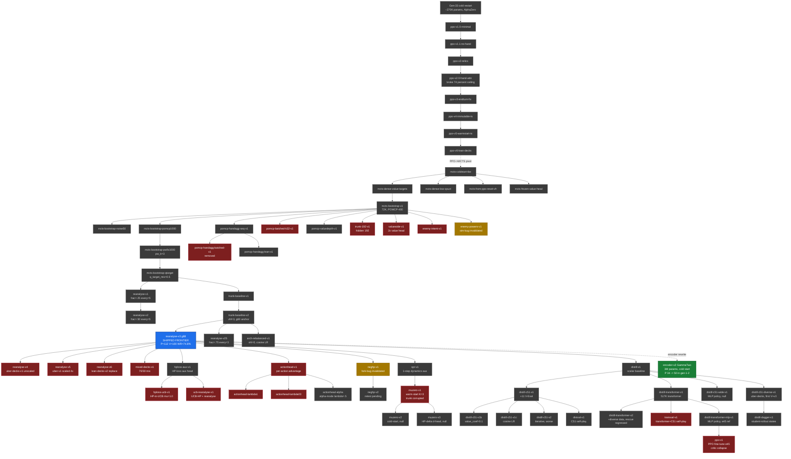

# AlphaZero / BetaOne / GammaTwo — Complete Experiment Timeline

Compiled 2026-04-22 from memory files, archived experiment configs/PLANs, git history, and top-level docs. Updated 2026-04-23 to cover the Distillation, DAgger, PPO-v1, and GammaTwo eras.

**Caveat:** the early PPO era is the thinnest section — most PPO experiments were already archived without rich `PLAN.md` docs, so it's reconstructed from memory + `config.yaml` only. Numbers in later eras pulled from concluded-gen records.

## Model families

- **AlphaZero** (Gen-33 cold restart through PPO v6, early April 2026) — original combat-net foundation. Shaped per-turn rewards, PPO self-play, ~270K params.
- **BetaOne** (MCTS-bootstrap onward, mid-to-late April 2026) — MCTS self-play replaces PPO, adds reanalyse, hand-attention + card embeddings, and a distributional value head in some variants. Name change reflected the architectural rewrite. ~50K-550K params across variants.
- **GammaTwo** (encoder-v2 forward, 2026-04-23) — new encoder (turn counters, potion inventory, pile-content pooled embeddings) + 10x capacity. Addresses the representational plateau hit by all BetaOne variants. ~3M params.

---

## Family tree

Status colours: blue = shipped frontier, green = running, grey = done/concluded, red = killed, amber = invalidated by bug.

---

## ERA 1: Foundation & AlphaZero baseline (early April 2026)

### Cold restart at gen 33
- **Status:** done (system health milestone, not a single experiment)
- **Arch:** ~270K params. State 451-dim. Card stats vector added to policy & option heads (enables generalization to unseen cards). Option head 335-dim + 2 hidden layers.
- **Training:** AlphaZero self-play with shaped per-turn rewards (HP/kill/offense/energy heuristics).
- **Search:** MCTS, 200 sims. Dirichlet noise (alpha=0.3, frac=0.25) at root.
- **Reward:** Per-turn heuristic targets + terminal.
- **Result:** Foundation reset. Encounter pool, Plating/Artifact engine, runner decision integrity all fixed.
- **Memory:** `project_incomplete_encounter_pool.md`

### PPO baselines (ppo-v1.0 through ppo-v6)
- **Status:** all archived. `ppo-v1.0-minimal`, `ppo-v1.1-no-hand`, `ppo-v2-relics`, `ppo-v2.0-hand-attn`, `ppo-v3-endturn-fix`, `ppo-v4-immutable-ts`, `ppo-v5-warmstart-ts`, `ppo-v6-lean-decks`.
- **Arch progression:** minimal -> +hand attention -> +relics -> +card embedding -> 49K to 291K params explored.
- **Training:** PPO with entropy coef tuning. End-Turn bias fixes. Lean-decks-v1 introduced.
- **Search:** none (PPO).
- **Reward:** Shaped per-turn + terminal.
- **Result:** All plateaued ~74% combat WR. Hand attention broke ceiling; capacity 49K-291K all hit same ceiling. Pivoted away from PPO toward MCTS self-play.
- **Memory:** `feedback_capacity_theory.md` ("capacity is scoped to PPO-era").

---

## ERA 2: MCTS-bootstrap pivot (mid-April 2026)

### mcts-coldstart-turn-boundary-eval
- **Status:** archived
- **Change:** First MCTS self-play cold-start. Turn-boundary eval added (only score states at end-of-turn boundaries to dedupe per-card eval noise).
- **Memory:** `project_mcts_selfplay_findings.md`

### mcts-dense-value-targets, mcts-dense-low-cpuct
- **Status:** archived
- **Change:** Dense value targets from MCTS (vs sparse terminal-only). Low c_puct sweep.

### mcts-from-ppo-reset-vh, mcts-frozen-value-head
- **Status:** archived
- **Change:** Warm-start from PPO with value-head reset, or frozen value head. Established that warm-start needs careful head handling.

### mcts-bootstrap-v1 (the canonical pivot)
- **Status:** done / shipped as template
- **Arch:** 72K params. hidden_dim=128, card_embed=16, card_stats=28, relic_dim=26, trunk_input=169, value linear 128->64->1.
- **Training:** Cold-start. `mcts_bootstrap=true` — MCTS root values become the value targets ([-1, 1.3] range).
- **Search:** POMCP, 400 sims, c_puct=1.5, Dirichlet frac=0.25, turn_boundary_eval.
- **Reward:** Pure terminal HP-scaled win/loss (per-turn shaping discarded).
- **Encounter set:** lean-decks-v1 (189 encounters).
- **Result:** Mechanism validated. Template for all future MCTS self-play experiments.
- **Memory:** `project_mcts_bootstrap.md`

### mcts-bootstrap-noise50
- **Status:** archived
- **Change:** Dirichlet frac 0.25 -> 0.50. Noise sweep.

### mcts-bootstrap-pomcp1000, mcts-bootstrap-pwfix1000
- **Status:** archived
- **Change:** Bumped POMCP to 1000 sims. pwfix1000 = applied progressive-widening fix #2 (pw_k=3).
- **Result:** pw_k=3 only +0.6 to +1.1 pt at inference. Search not the bottleneck.
- **Memory:** `project_pomcp_widening_fix.md`

### mcts-bootstrap-qtarget
- **Status:** archived (mixed result)
- **Change:** Policy targets become `(1-mix)*visits + mix*softmax(Q/temp)`, mix=0.5, temp=0.5.
- **Result:** +5pt eval, +2 draw category. But MCTS benchmarks tied. draw_cycle target metric regressed. Echo chamber not a policy-target-noise problem.
- **Memory:** `project_q_target_plan.md`

---

## ERA 3: Encoder ablations & search variants (mid-April)

### pomcp-handagg-seq-v1 / pomcp-handagg-batched-v1
- **Status:** seq=done, batched=removed
- **Arch:** +5 hand-aggregate features (total_damage, total_block, draw, energy, powers). state_dim 427->432, trunk_input=174.
- **Training:** Identical otherwise. Batched variant uses virtual-loss MCTS (batch=32).
- **Result:** Batched got 2x per-gen speedup but ~10-gen training-quality lag. Removed 2026-04-17.
- **Memory:** `project_handagg_features.md`, `project_virtual_loss.md`

### pomcp-handagg-lean-v1
- **Status:** archived
- **Change:** hand_agg_lean variant — fewer hand-agg dims, lighter encoder.

### pomcp-batched-k32-v1
- **Status:** archived
- **Change:** Batched MCTS k=32 standalone test. Confirmed sequential beats batched at this skill level.

### pomcp-valuedepth-v1
- **Status:** archived
- **Change:** value_head_layers depth study. Established hand-swap V-Eval failures motivating later signal experiments.

---

## ERA 4: Capacity sweep (late April)

### trunk-192-v1
- **Status:** killed at gen 30
- **Arch:** trunk hidden_dim 128->192. Otherwise 72K.
- **Result:** P-Eval 69/83, V-Eval 93/121. Did NOT unlock V-Eval ceiling. Gradient telemetry revealed `cos(g_P, g_V) ~ 0` and `|g_V|` dominates `|g_P|` 5-35x. **Key finding:** value head is the bottleneck, not trunk capacity.
- **Memory:** `project_trunk_192_telemetry.md`

### valuewide-v1
- **Status:** killed
- **Arch:** Value head 128->512->256->128->1 (~2x wider).
- **Result:** Overfitting signature — peak gen 10 then monotonic regress. Width alone insufficient.
- **Memory:** `project_capacity_dual_null.md` ("capacity dual-null" — both trunk and value width null).

### enemy-intent-v1
- **Status:** killed at gen 31
- **Arch:** +4 aggregate enemy features (total damage, block, count, strength).
- **Result:** conditional_value regressed 14/20 -> 12/20. Aggregates of already-encoded per-enemy state are redundant.
- **Lesson:** Add NEW info, not aggregates of existing state.
- **Memory:** `project_enemy_intent_v1.md`

### enemy-powers-v1
- **Status:** invalidated by sim bug
- **Arch:** Per-enemy Artifact/Plated/Intangible tracking.
- **Result:** Conclusions invalidated 2026-04-18 when sim bugs discovered (Intangible unimplemented, "Plated Armor" wrong name, Slippery/Shell ordered wrong). Don't trust this experiment's verdict.
- **Memory:** `project_simulator_bugs_2026_04_18.md`, `feedback_audit_sim_before_arch_conclusions.md`

---

## ERA 5: Reanalyse era (the foundation pivot, 2026-04-18 -> 04-20)

### reanalyse-v1 / reanalyse-v2
- **Status:** done, superseded by v3
- **Training:** Warm-start from tb-v2 g60. v1: `frac=0.25, every=5`. v2: `frac=0.50, every=5`.
- **Result:** Established that target-refresh reduces drift. v2 highest V-Eval mean (104.6) across all reanalyse variants (per multi-gen analysis).

### trunk-baseline-v1 / trunk-baseline-v2
- **Status:** done. tb-v2 finalized at g80, killed g92+.
- **Arch:** Hand-attn + card-embed + relics, 72K. vhl=3 added in tb-v2.
- **Training:** MCTS self-play, POMCP, mcts_bootstrap, q_target_mix=0.5, turn_boundary_eval.
- **Result:** P-Eval climbed 89->105 across gens 10-80. V-Eval collapsed 108->86 by g92 (stale-target drift). Motivated all reanalyse-v3 variants.
- **Memory:** `project_trunk_baseline_v_eval_lead.md`

### reanalyse-v3 — SHIPPED, current frontier
- **Status:** done / shipped / current production combat net
- **Arch:** vhl=3, hand_agg_dim=3, relic_dim=27, base_state_dim=156, state_dim=446, trunk_input=188, **140,761 total params**.
- **Training:** Warm-start from tb-v2 g60. `reanalyse_frac=0.75, reanalyse_every=2, reanalyse_min_gen=10`. mcts_bootstrap, q_target_mix=0.5, eval_every=1.
- **Search:** POMCP, 1000 sims, c_puct=1.5, turn_boundary_eval.
- **Result (g88, finalized):** P-Eval 112/128 (87.5%), V-Eval 100/121 (82.6%), WR 74.8% [73.0, 75.7], MCTS rescue 50%.
- **Key finding:** Cadence (every) > frac as the staleness lever. **This is the AlphaZero baseline you'd return to.**
- **Memory:** `project_reanalyse_v3_ship.md`

### reanalyse-v25 (midpoint cadence)
- **Status:** done / concluded at g20
- **Training:** Warm-start tb-v2 g60. `frac=0.75, every=3` (midpoint between v2's 4 and v3's 2).
- **Result:** g20 P=108, V=104. P decayed 110->100 by g44. V held. **Cadence is load-bearing for P too** — can't relax v3's every=2.
- **Memory:** `project_reanalyse_v25_concluded.md`

---

## ERA 6: Distribution-shift failures (2026-04-19 -> 04-22)

### reanalyse-v4 (uber-decks-v1 unscaled)
- **Status:** killed
- **Training:** Warm-start v3 g88 onto uber-decks-v1 (795 encounters, 4x larger than lean). v3's compute config unchanged.
- **Result:** `draw` category collapsed 10/10 -> 6/10. Per-encounter gradient attention dropped 4x.
- **Memory:** `project_uber_dist_shift_failure.md`

### reanalyse-v5 (uber-decks-v1 scaled 4x)
- **Status:** killed at peak g95
- **Training:** combats_per_gen 256->1024, replay_capacity 50K->200K. reanalyse_min_gen=99 (delayed activation).
- **Result:** P=109 peak (still under v3's 112), rescue dropped 57%->33%, top1_agree falling. **Compute scaling alone doesn't fix warm-start distribution shift.**

### reanalyse-v6 (lean-decks-v2 replacement)
- **Status:** killed at g26
- **Training:** Warm-start v3 g88 onto lean-decks-v2 (238 encounters: HP*0.81, +14 D&R/WF/Accelerant gap fillers).
- **Result:** P crashed 111->75 in gen 1, recovered to 89. Frequency-weighted gap fillers drowned out common-card sequencing.

### mixed-decks-v1 (70/30 lean-v1/v2)
- **Status:** killed at g32
- **Result:** P crashed 115->79 gen 1 — same as 100% replacement. **30% OOD exposure is enough to trigger forgetting cascade.**
- **Lesson:** Warm-start + ANY distribution change = systematic failure. Need KL-anchor or cold-start.

---

## ERA 7: Auxiliary head program (2026-04-19 -> 04-21)

### hploss-aux-v1
- **Status:** done / concluded g50
- **Arch:** 3rd head (~9K params) predicting normalized HP-loss-to-end. Reads trunk only.
- **Training:** mcts_bootstrap, hp_coef=1.0, hp_target_mix=0.5. Value reward stripped to pure win/loss.
- **Result:** V-Eval peaked 102/121 (didn't break 110 ceiling). H-Eval 71%. **Null at this config.** Signal-richness not ruled out — only this point in design space tested.
- **Memory:** `project_hploss_aux_v1_result.md`

### hploss-ucb-v1
- **Status:** killed at g60
- **Search:** UCB modified to `Q + mu*(1 - hp_loss)` at mu=1.0.
- **Result:** P-Eval monotonic decline 96->89. Worst trajectory seen.
- **Memory:** `project_hploss_ucb_v1_killed.md`

### ucb-reanalyse-v1
- **Status:** killed
- **Combination:** HP-in-UCB + reanalyse `frac=0.5, every=4`.
- **Result:** V-Eval collapsed 59.5% then bounced. Reanalyse couldn't rescue.
- **Memory (meta):** `project_ucb_hp_dead_end.md` — across 3 experiments + 2 inference sweeps, UCB-HP either no-ops (mu=0.3-0.5) or damages (mu=1.0). Dead end without per-action HP architecture.

### actionhead-v1 (beta-mode), actionhead-lambda1, actionhead-lambda03
- **Status:** all regressed
- **Arch:** Per-action advantage head A(s,a) ~ Q_mcts(s,a) - V_mcts(s).
- **Integration:** beta-mode (replace Q entirely) at lambda=1.0 and lambda=0.3 — both regressed P-Eval vs v3.

### actionhead-alpha (alpha-mode)
- **Status:** done / concluded g47
- **Integration:** alpha-mode = advantage as initial Q for unvisited children only, lambda=0.5.
- **Result (binary suite):** P 106 / V 98 / rescue +0.04. **Pareto-similar to v3, not better.**
- **Critical correction:** Pre-binary-suite reported rescue +0.40 (MIXED-inflated). Binary-suite real number is +0.04.
- **Memory:** `project_actionhead_alpha_concluded.md`, `feedback_binary_eval_labels.md`

### arch-rebalanced-v1
- **Status:** done / concluded g44
- **Arch:** value_head_layers 3->0 (ultra-thin), cosine LR.
- **Result:** g44 P=99, V=108, WR 71.1%. V regressed 108->98 by g70. Draw category 60% ECHO baked in by g25. Pareto-dominated by reanalyse-v25.
- **Memory:** `project_arch_rebalanced_v1_concluded.md`

### neghp-v1
- **Status:** **INVALIDATED** by fork bug
- **Reward:** Smoothed terminal — `Win: (1 + (hp_end - hp_start)/hp_max).clamp([-1, +1]); Loss: -1`.
- **Result:** Reported P-Eval drop, but value_head silently random-init'd from fork bug (vhl=1 vs v3's vhl=3). Actually tested "smooth reward + cold V-head."
- **Memory:** `project_neghp_v1_failure.md`. Re-test pending as neghp-v2.

---

## ERA 8: Dynamics & MuZero (2026-04-20 -> 04-22)

### spr-v1 (Self-Predictive Representation)
- **Status:** done / concluded g20
- **Arch:** DynamicsHead `(trunk_h + pi_mcts) -> next_trunk_h`. ~20K extra params. Loss `L_policy + L_value + 0.5*L_spr`.
- **Training:** Warm-start v3 g88. v3's reanalyse config.
- **Result (binary):** Policy-only WR 56.76% vs v3's 56.68% — **tied (n=9450)**. P-Eval -6 vs v3. Rescue +0.060 (only real win).
- **Key finding:** Teacher-student gap is **compute-structural, not features-structural**. Planning-aware features can't substitute for planning compute. Rules in MuZero (gives policy actual planning compute at inference).
- **Memory:** `project_spr_v1_concluded.md`

### muzero-v1 (warm-start)
- **Status:** killed at gen 12
- **Arch:** v3 g88 + random-init DynamicsHead, K=3 unroll, reward prediction head.
- **Training:** Warm-start v3 g88. K-step unroll for policy/value/reward.
- **Search:** POMCP 1000 (Rust sim still used at inference; dynamics is training-time only).
- **Result (g1 eval):** P 75/136 — crashed from v3's 115. Reward_loss healthy (0.044), policy_loss_stepK 0.082 (well below 2x kill threshold).
- **Diagnosis:** Random-init aux head's high gen-1 loss perturbed shared trunk before head stabilized. Trunk drift corrupted pretrained P/V heads.
- **Lesson:** Warm-start + random-init aux head ALWAYS damages trunk. MuZero paper cold-starts for this reason.

### muzero-v2 (cold-start) / muzero-v3 (HP-delta reward)
- **Status:** both concluded/null.
- **muzero-v2:** cold-start version of muzero-v1. Plateaued P=92 / V=98 by gen 19. Dynamics head IS learning (reward_loss 0.039) but doesn't move eval. Never reached v3's 115/100.
- **muzero-v3:** HP-delta d-head + pure +/-1 value head. Peak P=94 (+2-9 over v2) but V-Eval tanked to 40-72. HP-delta signal learnable but must pair with HP-shaped value targets via engine, not broadcast.
- **Verdict (3 nulls across muzero family):** teacher-student gap is compute-structural. Stop investing in dynamics-alone experiments.
- **Memory:** `project_muzero_v2_concluded.md`, `project_muzero_v3_concluded.md`

---

## ERA 9: Distillation (2026-04-22)

Supervised distillation of v3 + MCTS-2000 into various student architectures. All variants plateau at the same policy-only WR ceiling as their teacher, confirming imitation can't exceed teacher quality.

### distill-v1 (baseline scalar)
- **Status:** concluded.
- **Arch:** BetaOne 144K params, scalar value head. Trained on v3 + MCTS-2000 labels (13K states).
- **Result:** P-Eval=105, policy-only WR tied with v3 at n=9450.
- **Memory:** `project_distill_v1_concluded.md`

### distill-c51-v1 (distributional value head)
- **Status:** concluded.
- **Arch:** BetaOne with C51 head (51 atoms, v_min=-1.2, v_max=1.5).
- **Result:** **V-Eval +11 (96 vs scalar 85)**, same P-Eval (106). Value-head arch scales V-Eval; policy ceiling unchanged.
- **Follow-ups:** v1b (value_coef=0.1) null. v1c (cosine LR 200ep) traded +3 P for -7 V.
- **Memory:** `project_distill_c51_v1_concluded.md`

### distill-c51-v2 (iterative — distilling distill-c51-v1's outputs)
- **Status:** concluded.
- **Result:** WORSE on every metric than c51-v1. Distilling from a not-better teacher compounds errors.
- **Memory:** `project_iterative_distill_closed.md`

### distill-transformer-v1 (transformer trunk)
- **Status:** concluded.
- **Arch:** 517K transformer student (3.6x v3). Entity-tokenized attention over [CLS, player, 5 enemies, context, 10 hand].
- **Result:** P=103 (same ceiling). Best curated rescue (+15%) but MCTS-1000 WR tied with v3 at n=5670.
- **Memory:** `project_distill_transformer_v1_concluded.md`

### distill-transformer-v2 (transformer + diverse data)
- **Status:** concluded.
- **Result:** Peak P=108 within noise. **Consistently -10 to -20% rescue** across 40 eval points. Arch x data overfits the value head.
- **Memory:** `project_distill_transformer_v2_concluded.md`

### distill-c51-wide-v1 / distill-c51-diverse-v1
- **Status:** both concluded.
- **wide-v1:** MLP policy head, null.
- **diverse-v1:** uber-decks distillation. **First student to beat v3 on V-Eval (102 vs 100)** and best curated rescue (+19%). BUT MCTS-1000 WR on uber = 65.5% vs v3's 68%. Curated rescue != real WR.
- **Memory:** `project_distill_policy_bottleneck_tests.md`

### Distillation era verdict
All 9 supervised variants cap at roughly v3-parity on policy-only WR (~48% on uber-decks-v1). Arch changes (transformer, wide), data changes (uber-decks), loss regime (C51, cosine), nothing moves the ceiling. Final diagnosis: **imitation-learning distribution shift** — student trained on states teacher visits, which systematically under-represents the close-call decisions the student itself will face.

### distval-v1 (C51 self-play follow-on)
- **Status:** concluded at gen 19.
- **Result:** vc=1.0 variant plateaued P 71-73. vc=0.1 variant climbed to P=88 at g19 then regressed to 76. Finalized to free compute.

### transval-v1 (transformer + C51 self-play)
- **Status:** killed at gen 1.
- **Rationale:** distillation variants already showed transformer + MCTS = v3 + MCTS within 0.1pp. Mechanism falsified; not worth compute.

---

## ERA 10: DAgger (2026-04-22 late)

### distill-dagger-v1
- **Status:** concluded.
- **Approach:** Classic Ross et al. 2011 DAgger — student generates states via self-play, teacher labels them. Attacks the distribution-shift diagnosis directly.
- **Config:** distill-c51-diverse-v1 as sampler, v3 + MCTS-2000 as labeler via `betaone_mcts_reanalyse` FFI. 2000 combats, 1000 sampler sims, 2000 teacher sims, temp=1.5, noise_frac=0.5.
- **Result:** Still at v3 parity on policy-only WR. The imitation ceiling is real even when the distribution gap is fixed.
- **Compute:** ~70 min dataset gen + 30 min training. Zero Rust changes — co-opted the reanalyse primitive.
- **Memory:** `project_dagger_v1_inflight.md`

---

## ERA 11: PPO v1 fine-tune (2026-04-22 night)

### ppo-v1
- **Status:** concluded/null at gen 50. Name collision with earlier AlphaZero PPO era — distinguish by date and arch.
- **Approach:** PPO fine-tune of distill-transformer-mlp-v1/e45 student. First session experiment using a training algorithm *capable* of exceeding teacher (PPO is unbounded by teacher; supervised + DAgger are).
- **Config:** lr=1e-4, clip_ratio=0.2, value_coef=0.5, entropy_coef=0.01, kl_coef=0.05 toward frozen e45 ref, gamma=0.99, lam=0.95, ppo_epochs=4, batch_size=256, temperature=1.0 rollouts. 50 gens x 256 combats = 12,800 combats total.
- **Result (apples-to-apples n=23,850):** v3=48.01%, e45=48.13%, PPO=48.26%, all CIs overlap. **Policy didn't move.** Additionally P-Eval dropped ~15 points and V-Eval dropped ~44 points vs v3 — value head saturated at +1.284 on most states (critic collapse).
- **Diagnosis:** compute budget ~50x too small (12.8K combats); sparse +/-1 reward + KL anchor induced critic collapse while policy stayed frozen. 
- **Verdict (combined with ERA 9-10):** At the budgets we can run on CPU, no training algorithm escapes the imitation ceiling. Bottleneck is representational, not algorithmic.
- **Memory:** `project_ppo_v1_concluded.md`, `feedback_benchmark_bundle.md`

---

## ERA 12: GammaTwo — encoder-v2 (2026-04-23 in flight)

### encoder-v2
- **Status:** running, gen 2/200 complete at time of writing.
- **Approach:** Full rewrite of the state encoder + 10x capacity bump. Addresses the 2026-04-22 finding that the BetaOne plateau was representational, not capacity/algorithm.
- **Encoder changes vs BetaOne (arch_version 2 -> 3):**
  - +3 turn-counter dims: `cards_played_this_turn`, `attacks_played_this_turn`, `_skills_played`. Storm of Steel, Kunai, Shuriken, Velvet Choker, Smoggy, Pocketwatch all depend on these.
  - +18 potion-inventory dims: 3 slots x 6 fields (empty_flag, heal, block, strength, damage_all, enemy_weak). Closes "don't know what potions I'm holding" gap.
  - +3 new pile-ID tensor inputs: `draw_pile_ids[30]`, `discard_pile_ids[30]`, `exhaust_pile_ids[20]`. Embedded via shared card_embed + mean-pooled over non-PAD, concat to trunk. Opens Tactician/Reflex/Calculated-Gamble reasoning.
  - state_dim 446 -> 467, trunk_input 188 -> 561.
- **Capacity changes vs v3:**
  - card_embed_dim 16 -> 64 (highest-leverage: now used across hand/action/3 piles).
  - hand_proj_dim 32 -> 192.
  - trunk 2x128 -> 4x768.
  - policy_head_type dot_product -> MLP (hidden 512).
  - value_head_layers 3 (same).
  - **~3.05M params (10x v3).**
- **Training recipe:** identical to reanalyse-v3 (num_sims=1000, combats=256, replay=50K, train_epochs=4, c_puct=1.5, pomcp=true, mcts_bootstrap, turn_boundary_eval, q_target_mix=0.5, reanalyse_every=2, reanalyse_frac=0.75). Deltas: lr 3e-4 -> 1e-4 (bigger model), reanalyse_min_gen 10 -> 30 (cold-start needs more gens).
- **Sim ramp:** linear 400 -> 1000 across gens 0-29. Untrained net doesn't benefit from deep search; ramp saves ~half the compute in the first 30 gens.
- **GPU opt-in:** DirectML execution provider wired via `STS2_BETAONE_GPU=1` env var. Batch=1 benchmark showed 1.2x speedup at 3M params, but 16-thread rayon serialization on a single GPU device makes production training slower than CPU. Kept as a hook for future virtual-loss MCTS work where inference batches.
- **Early results (gen 1-2 at 400 sims):**
  | Gen | num_sims | P-Eval | V-Eval | WR | policy_loss | value_corr |
  |---|---|---|---|---|---|---|
  | 1 | 420 | 46/136 (34%) | 72/121 (60%) | 16% | 0.77 | 0.15 |
  | 2 | 440 | 68/136 (50%) | 84/121 (69%) | 21% | 0.76 | **0.40** |
  
  **Fastest early trajectory any experiment has shown.** +22 P-Eval and +12 V-Eval in a single gen after cold-start is unprecedented at this stage.
- **Kill criteria:** P-Eval <= 95 at gen 20 = representational-diagnosis falsified, stop.
- **Ship criteria:** P-Eval > 130 OR V-Eval > 120 at gen 50 = combat-net ceiling broken.
- **Compute projection:** ~16 min/gen at 420 sims, scaling ~linearly to ~38 min at 1000 sims. Steady-state gens 30+ add ~10 min reanalyse every 2 gens. Total ~5-6 days for 200 gens.
- **Worktree:** `C:\coding-projects\sts2-encoder-v2` on branch `experiment/encoder-v2`.
- **Commits:**
  - `06c6824` encoder-v2: add turn counters, potions, pile ID tensors + 10x capacity
  - `8a3d41b` encoder-v2: sim ramp 400->1000 over gens 0-29 + opt-in DirectML GPU

---

## What's been ruled out (the pivot decision matrix)

### Architecture (capacity / shape)
- **Trunk hidden_dim 128->192:** No V-Eval ceiling unlock (trunk-192-v1).
- **Value-head width 2x:** Overfitting (valuewide-v1).
- **Value-head depth vhl=3->0:** Faster early but worse multi-gen (arch-rebalanced).
- **Verdict:** Capacity is NOT the binding constraint at any tested scale. Value-head **calibration** (not size) is the real bottleneck.

### Feature engineering
- **Hand aggregates (5 dims):** Modest help, not a leap.
- **Enemy aggregates of visible state:** Regressed conditional_value.
- **Per-enemy powers:** Conclusion invalid until sim bug fixes (2026-04-18) re-tested.
- **Verdict:** Adding NEW info > aggregating existing.

### Search modifications
- **POMCP pw_k=1->3:** +0.6 to +1.1 pt only.
- **Virtual-loss / batched MCTS:** 2x per-gen speedup wiped by training lag. Removed.
- **UCB-HP at mu>=1:** Damages. At mu=0.3-0.5 no-op.
- **Verdict:** Search is not the binding constraint.

### Policy / value targets
- **Q-target mixed policy (mix=0.5):** Eval gain +5pt didn't translate to combat WR.
- **Smoothed terminal reward:** Confounded by fork bug; pending honest retest.
- **Verdict:** Echo chamber is not policy-target-noise.

### Auxiliary heads
- **HP-loss aux (training-only) at hp_coef=1, mix=0.5:** Null at this point.
- **Per-action advantage (alpha-mode):** +0.04 rescue, Pareto-similar to v3.
- **SPR dynamics (1-step):** Tied policy-only WR exactly with v3 at n=9450.
- **MuZero K-step warm-start:** Trunk-corruption failure.
- **Verdict:** No aux-head-alone closes the teacher-student gap. Compute-structural, not features-structural.

### Distribution shift on warm-start
- **uber-v4 unscaled, uber-v5 4x scaled, lean-v2 replace, 70/30 mixed:** ALL crashed.
- **Verdict:** Warm-start + any distribution change = forgetting cascade. Need KL-anchor or cold-start to even attempt distribution coverage.

### Multi-experiment patterns
- **Higher V-Eval correlates with WORSE MCTS rescue** (v3, v25, arch-rebalanced — 3 independent points). V-magnitude miscalibrates at MCTS leaves. (`project_v_eval_mcts_tradeoff.md`)
- **Single-gen V-Eval is noisy +/-5pt** — always average >=5 gens. (`feedback_eval_vs_wr.md`)
- **MIXED labels distorted pre-2026-04-21 cross-experiment claims** — re-check anything pre-binary suite. (`feedback_binary_eval_labels.md`)

---

## Open / not-yet-tried directions

Remaining after the Distillation / DAgger / PPO-v1 sweep (which falsified items 5 and 7 at this compute scale):

1. **V-temperature at inference** — post-hoc V scaling at MCTS leaves (addresses V>100 -> rescue<0 pattern).
2. **V-ensemble** — 2-3 V heads, take min/median at leaves.
3. **Leaf-state augmentation in V training** — sample intermediate rollout states, not just root.
4. **Policy-rollout leaf eval** — K-step rollout instead of V at leaves.
5. **MuZero with cold-start + trunk-freeze warmup** — muzero-v2/v3 cold-start null; freeze-warmup still untested.
6. **HP-loss aux at different `hp_coef`/`hp_target_mix`** — only one point in design space tested.
7. **Per-action advantage head with different integration** — alpha at different lambda values.
8. **Virtual-loss MCTS + GPU batched inference** — GPU path is wired (`STS2_BETAONE_GPU=1`); needs an inference batcher to actually win over CPU at 3M params.
9. **PPO v2 with HP-delta reward shaping + 5x budget** — PPO v1 failed on sparse +/-1 + small compute; rich reward + more combats hasn't been tested.
10. **ChooseCard source-context fix** — Tactician pick vs Survivor discard currently encode identically; add source-card flag to action features.

### Falsified (no longer open)
- **Distillation** (ERA 9): 9 variants all capped at v3 parity. Imitation ceiling is real.
- **KL-anchor RL at low budget** (ERA 11, PPO-v1): KL=0.05 over 12.8K combats induced critic collapse without moving policy.
- **Cold-start on expanded distribution**: tried as reanalyse-v4/v5 (uber unscaled/scaled), mixed-decks-v1, reanalyse-v6 (lean-v2). All regressed. Warm-start + distribution change = forgetting cascade; cold-start on expanded distribution needs a richer encoder first (GammaTwo is testing exactly this).

---

## Current state at 2026-04-23

- **Production frontier:** reanalyse-v3 g88 (P=112, V=100, WR=74.8%). Last BetaOne to ship; has stood since 2026-04-20.
- **In flight:** GammaTwo `encoder-v2` (see ERA 12). Gen 2/200 showing fastest early eval trajectory of any experiment.
- **Diagnostic history the GammaTwo hypothesis rests on:**
  - 20+ BetaOne variants (ERA 1-11) all plateaued at ~P=115 / ~V=100 / ~48% policy-only WR on uber-decks.
  - Capacity bumps (trunk-192, valuewide), loss regimes (C51, hp-aux, SPR), training algorithms (supervised distill 9x, DAgger, PPO), data distributions (uber-decks, lean, mixed) — ALL null at v3's ceiling.
  - 2026-04-23 encoder audit identified concrete gaps: turn counters, potion inventory, pile contents missing from encoder entirely. GammaTwo closes all three.
- **Falsification path:** if GammaTwo gen 20 P-Eval <= 95, the representational-gap hypothesis is wrong and ceiling is elsewhere (training algorithm / compute scale / fundamental architecture choice).
